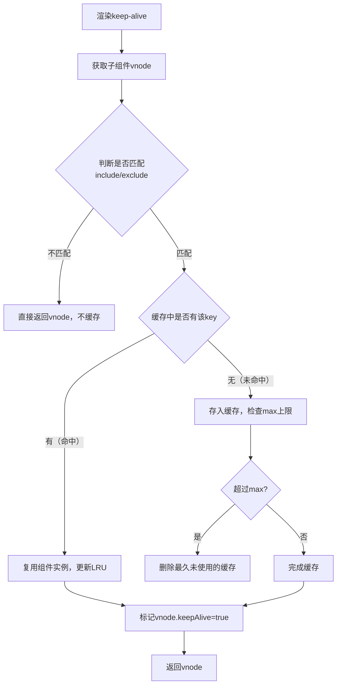

## vue 相关知识

1. 响应式原理
1. diff算法
vue2 
按照 老/新 vnode进行 头头  尾尾 头尾 尾头 key映射 的书序进行对比
key的作用: 
1. key相同并且tag相同，会被复用。 提高效率
2. diff时可以进行key映射查询，提高查询效率
就地更新的逻辑:
1. 无key时，会直接认为所有的vnode都是可复用的

因此，key应该是唯一的，并且避免重复。 建议使用数据ID等不重复的进行，避免使用index或者随机数
```mermaind 
graph TD
A[初始化双端指针] --> B{第一步：头头对比（oldStart ↔ newStart）}
B -->|匹配（key相同）| C[复用节点，指针后移：oldStartIdx++、newStartIdx++]
B -->|不匹配| D{第二步：尾尾对比（oldEnd ↔ newEnd）}
D -->|匹配| E[复用节点，指针前移：oldEndIdx--、newEndIdx--]
D -->|不匹配| F{第三步：头尾对比（oldStart ↔ newEnd）}
F -->|匹配| G[复用节点，oldStartIdx++、newEndIdx--，并移动DOM到尾部]
F -->|不匹配| H{第四步：尾头对比（oldEnd ↔ newStart）}
H -->|匹配| I[复用节点，oldEndIdx--、newStartIdx++，并移动DOM到头部]
H -->|不匹配| J{第五步：key映射表查找newStartVnode}
J -->|找到匹配节点| K[复用节点，移动DOM到当前位置，oldStartIdx++]
J -->|未找到| L[创建新节点插入DOM，newStartIdx++]
A --> M{循环终止条件：oldStartIdx > oldEndIdx 或 newStartIdx > newEndIdx}
M -->|旧列表遍历完| N[新增新列表剩余节点]
M -->|新列表遍历完| O[删除旧列表剩余节点]
```

vue3 
优化点: 
1. patchFlag, 不需要全量进行遍历
1. 通过LIS进行优化，最小化dom操作
1. 静态资源声明提升, 不重复创建vnode
1. 对事件处理函数进行缓存 

shapeFlag:
1. 说明元素是什么(元素/组件/文本/slot/Keepalive)
1. 减小判断开销，不管是在diff阶段还是挂载阶段

1. computed原理

1. nextTick原理
原理: 根据环境选择使用Promise -> MutationObserver -> setImmediate -> setTimeout, 优先使用微任务提高性能

特点: 有防抖处理，多次调用也只会执行一次，通过callbacks数组存储所有nextTick回调，最终通过timerFunc进行调用
1. keep-alive 组件

基础原理: 通过一个Object来存储组件，key为cid+componentName, value为vnode,同时通过一个叫keys的数组来存储缓存的组件名，模拟LRU策略

特点: 切换时不会触发created/mounted, 触发activated/deactivated

流程: 渲染 -> 判断是否匹配include / exclude -> 缓存 -> 标记keepAlive = true -> 返回vnode 



淘汰策略: 模拟LRU策略，命中缓存时会把命中的组件放到末尾，达到组件设置的max时，淘汰第一个

1. ref 和 reactive区别
原理: 复杂类型使用proxy，简单类型无法被proxy代理，所以代理了基础类型的getter / setter 

1. Reflect的核心作用
作用: 
1. 保证this指向正确
1. 标准化操作结果，Reflect总是返回布尔值或者是操作结果。其他的api不统一
1. 兼容特殊数据对象，比如map、set
1. 简化原型链属性的处理逻辑，因为Reflect会严格遵循原型链

1. vue编译原理
顺序: 
 1. 递归解析模板，先解析文本、插值，然后解析元素及元素子节点 
 1. 在此过程中对事件、指令进行解析
 1. transform过程同时进行优化，包含标记静态节点，根节点、patchFlag、静态元素提升和事件缓存，指令转换，优化后输出了带patchFlag的ast
 1. 生成render函数，通过遍历+字符串拼接，在这个过程中递归并判断子元素类型，包括元素、插值、文本、指令等，各自进行处理

 1. 指令编译
    1. v-if v-on 先编译为ast，然后编译为函数，底层编译为三元表达式或者是map
    1. slot：vue2普通slot会被编译为vnode，vue3都编译为render函数，render函数执行时才会渲染，不需要编译为vnode，提高性能，把作用于绑定到父组件，避免vue2中作用域混淆
1. Provide/Inject
原理: 
    1. provide会将数据挂载到provides对象，当前实例的provides对象是从parent.provides继承而来
    1. 组件调用provide时，会在自己的provides上面新增属性，覆盖父组件的同名key,但是不影响父组件
    1. inject取值时，会层层向上遍历，查找provides中的key
    1. 本身不支持响应式，但是可以传递响应式数据

1. 异步组件

1. 组件生命周期
触发方式: 各个阶段手动调用callHook触发  
合并策略: 按照先mixin后组件的方式，以数组形式进行合并
执行顺序: mixin -> extend -> 组件  多个mixin按照数组顺序
触发阶段: created(有状态无dom)  -> mounted(有dom)
vue3的区别: 
    1. 组合式api相比option api 更清晰
    1. 从组件选项变为了 函数调用
    1. 底层是effect副作用函数
    1. 可以更好的复用
    1. 无this绑定，状态通过闭包保存


1. vue3声明周期重构
时机：vue2 beforeCreate(无状态无dom), created(有状态无dom) setup: 组件实例创建后，状态初始化前
优势: 
    1. 无this，因此不受限
    1. vue2钩子是手动调用callHook，属于被动调用。 vue3 setup是主动执行初始化
    1. setup会被作为依赖收集，进行优化
    1. 依赖effect，组件卸载时会停止所有依赖。避免了vue2手动清理不及时和不彻底
原理: 通过registerHook注册到组件的实例，在生命周期的对应时间，由setupEffect执行


1. Teleport
通过剪切当前元素的dom到指定为止，但是保持上下文和状态不变
原理: 通过传入的标签，选择器，ref，调用insertBefore进行插入。卸载时再移动回去


1. 计算属性
依赖收集 + 懒执行 + 脏标记，数据会被缓存，但是需要被访问时执行
和watch的区别是，watch时主动执行
处理数据时，优先使用computed，执行异步函数或者操作dom使用watch


1. vue router初始化流程
    1. 构建路由映射表
    2. 生成路由
懒加载的支持: router不进行组件的加载，借助esmodule + 异步组件进行，其实是等待组件加载完成后再执行后续守卫