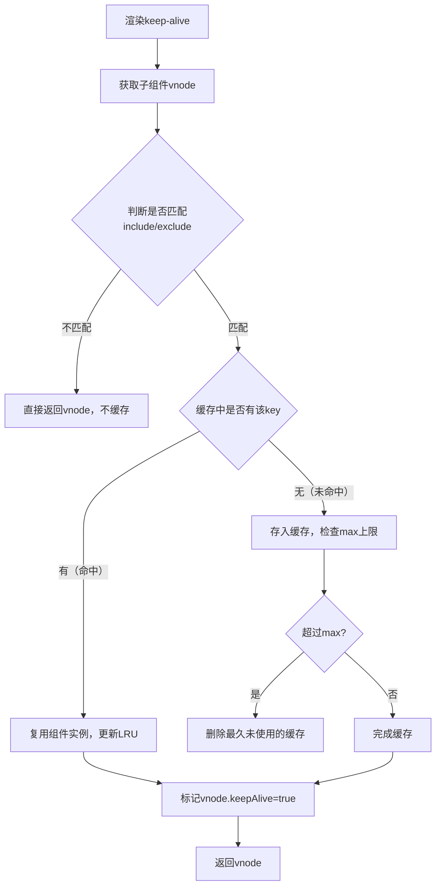

# vue 相关知识

1. keep-alive 组件

基础原理: 通过一个Object来存储组件，key为cid+componentName, value为vnode,同时通过一个叫keys的数组来存储缓存的组件名，模拟LRU策略

特点: 切换时不会触发created/mounted, 触发activated/deactivated

流程: 渲染 -> 判断是否匹配include / exclude -> 缓存 -> 标记keepAlive = true -> 返回vnode 

淘汰策略: 模拟LRU策略，命中缓存时会把命中的组件放到末尾，达到组件设置的max时，淘汰第一个

